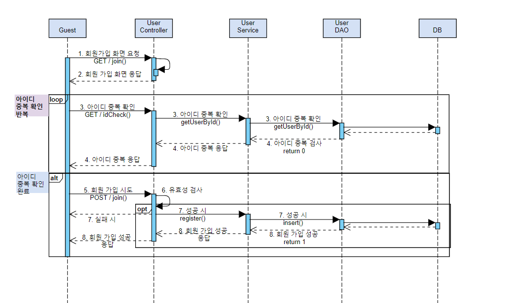
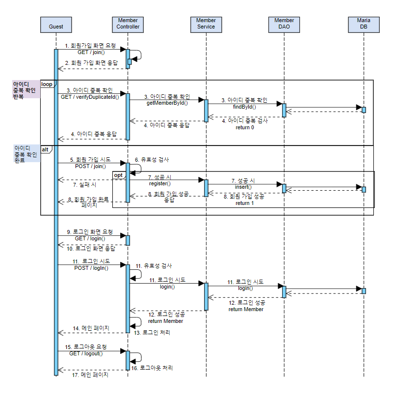
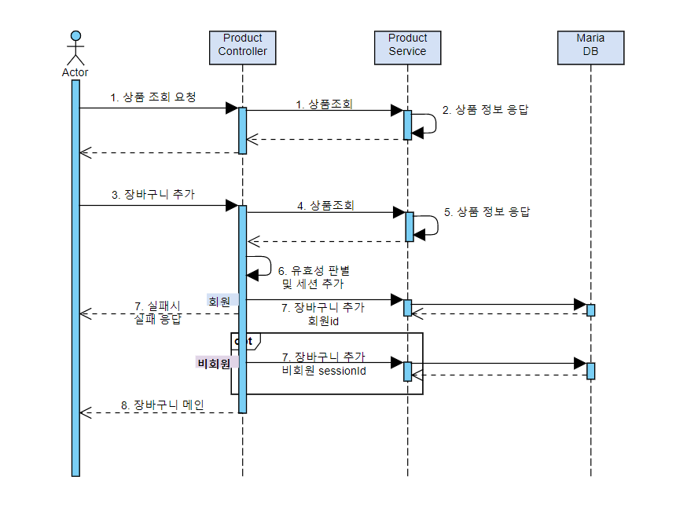
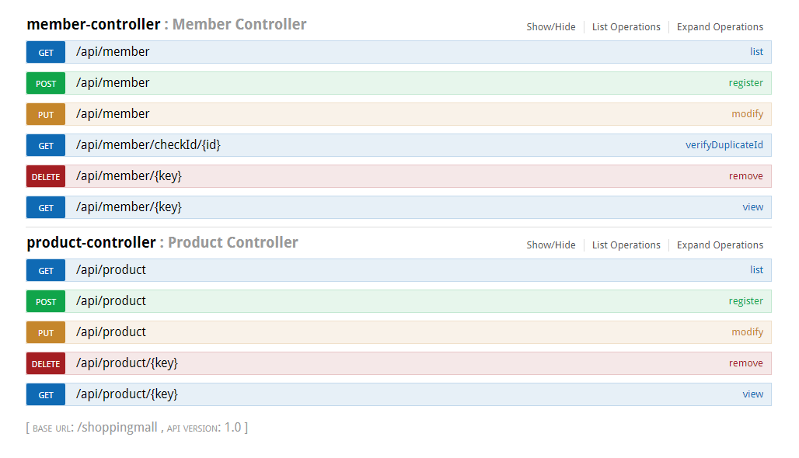
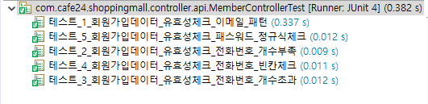
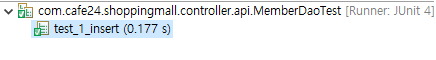
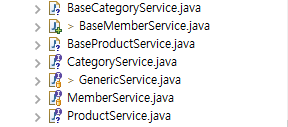

## 쇼핑몰 만들기 프로젝트
### 1주차
 - 기본 기획 WIKI 작성
 - ERD 및 유스케이스 작성
 - [참고](https://github.com/nelldkLee/shoppingmall/wiki)

### 2주차
#### Day1,2
 - 시나리오 작성
    - 회원가입 시나리오 작성
    - 
 - 기본 개발 환경 구성(Eclipse, Spring 4.3.1, 기타 필요한 라이브러리 pom.xml 구성)
--------------------------------------------
#### Day3
##### 작업할 내역
 - 로그인 시나리오 추가
    - 
 - TDD 적용
 - 기본 Controller, Service, Dao 등에서 사용할 interface 설계
 - Validation
     - Spring에서 지워하는 @Valid 어노테이션 적용
 - 장바구니 시나리오 작성
    - )
#### 이슈사항
 - RESTFul한 설계와 기본 페이지전환 방식의 설계의 차이로 인해 Controller 설계의 어려움이 있음
    - jsp가 아닌 html페이지와 Ajax호출을 통한 화면 구성

--------------------------------------------

#### Day4
- 기본 Controller, Service, Dao 등에서 사용할 interface 설계 수정
- Validation
     - Spring에서 지워하는 @Valid 어노테이션 테스트
- VO작업 및 ERD 수정
- RESTFul 설계 수립
    - 

#### Day5
- TDD 회원가입 유효성 체크
    - 

#### 이슈사항
- 유효성 체크 Exception을 받는 위치 문제로 고민
    - Cotroller 단에서 @valid가 명시된 매개변수 다음 인자로 BindResult를 통한 해결방식
    - @ControllerAdvice 어노테이션을 통해 Exception 핸들러를 통한 해결방식
    ```
    공통단에서 처리 하는 방식으로 정함. 역할과 책임을 분리하여 Controller에선 유효성 부분을 없애는 방식. 
    회원 뿐만 아니라 상품 및 주문 Controller에서도 @ControllerAdvice에 basePackages에 패키지 추가하면 간단히 끝남
    ```

### 3주차
#### Day1
- Repository 인터페이스 구성
```java
public interface GenericRepository<T, K> {

	public int insert(T vo) throws Exception;

	public T read(K key) throws Exception;

	public int update(T vo) throws Exception;

	public int delete(K key) throws Exception;

	public List<T> getList(Criteria cri) throws Exception;
}
```
- DAO TDD 작업 진행 중

- DAO TDD를 통한 erd 수정
- MariaDB 유저 생성 및 권한 부여 설정

#### Day2
- DataAccess 영역 TDD 작성(o)
- 기본 TDD 틀에 따라 일정 정리 및 계획 수립.(x)

#### 이슈사항
- DataAccess 영역 TDD 작성 시 insert, get, list, update, delete 등의 테스트를 진행하는데 앞서 deleteAll을 무조건 해야하는가라는 부분
    - dummy data에 따라 list의 옳고 그름이 결정되는 바. list는 자동화 테스트 제외.
- 'Service Layer와 Repository Layer에서 판단을 내리는 역할을 누가 할것인가?'라는 고민
    - Repository Layer는 Data를 JDBC Connectoin과 연결하고 데이터를 가져오는 역할에 집중
    - Service Layer에서 Transaction 등의 처리와 함께 판단은 Service Layer에서 하는 걸로 정함. 
- 아이디 중복검사를 통과한 상황이며 가입을 진행 중 다른 여러명이 같은 아이디로 중복검사를 통과하였을 시 제어를 하는 부분이 없다.
    - 아이디는 Unique하기 때문에 나중에 가입 하는 사람은 SqlException이 발생할 것으로 판단된다.
    - SqlException을 잡아서 해당 부분을 파악하고 customException으로 RuntimeException을 던지기로 결정. 
- Repository Layer에서 sqlSession의 메소드 호출 시 SqlException이 발생한다.
    - checked Exception으로 계속 throw 해야할지 try catch로 잡아야 할지 고민.
    - 우선 ControllerAdvice로 Exception 일괄처리 하는 객체에게 책임을 넘기기로 결정.
    - ``잘못알고 있던 부분 :`` Spring에서 checked Exception인 SqlExceptoin을 이미 try catch하여 관리하고 있었다.

#### Day3
- 회원과 상품 이외에 주문, 장바구니 등의 도메인 설계와 그에 따른 Controller 등의 인터페이스 설계
- AbstractController의 설계로 개발 속도 향상

#### 이슈사항
- Service Layer에서의 메소드와 클래스 네이밍 컨벤션을 고민.
    - 구현한 클래스는 Base*** 형태로 작성
    - 

#### Day4
- Dao와 SqlSession이 사용되던 스펙에서 Mapper 인터페이스 스펙으로 변경
- 상품 및 주문 등의 도메인과 그에 따른 Business Layer(Service)의 설계 
#### 이슈사항
- Mapper 인터페이스로 변경흐름
    - @MapperScan 어노테이션을 통해 mapper 인터페이스와 xml을 연동한다.
    - src/main/resources 소스폴더 아래에 위치한 폴더 구조를 Java package 구조와 같게하면 Java 파일이 컴파일 되며 package를 폴더화하며 같은 구조에 데이터가 묶이게 된다. 그 때 @MapperScan은 xml에 선언된 mapper의 namespace에 명시된 이름과 해당 인터페이스를 바인딩하여 빈으로 등록한다.
- ```MemberMapper.xml, MemberMapper 인터페이스, xml 내부에 namespace 이름 동일하게 하기```
- 도메인을 기반으로 Service Layer를 설계하는 부분에서 어려움을 느낌
    - 상품과 상품디테일이 각각 VO로 나뉘어 있으며 상품에 List형태로 상품 디테일이 존재
    - 이러한 경우 Service는 상품만 있으면 되려나? 상품디테일을 수정을 한다하면 상품디테일은 어떤 Service와 관계를 맺으면 될지 고민 중... 


#### Day5
- 상품 및 장바구니 프로세스 진행

#### 이슈사항
- Join해서 가져오는 데이터의 정도를 고민
    - 장바구니 같은 경우 상품 가격, 상품 이름, 옵션 데이터가 추가로 보여져야 하므로 그에 해당하는 정보를 가져오기로 결정

### 3주차
- 일정 테이블 수정 및 md파일로 변경

번호 |  API  | URL |  METHOD | 일정 | 예상시간 | 진행시간 | 완료
------- | ------- | ------- | ------- | ------- | ------- | ------- | -------
1 | TDD 환경구축 ||| ~7.12 |  |  | O
2 | API 설계 | RestController URL 설계 |  | 7.15 ~ 7.16 |  |  | O
3 | API 설계 | Controller,Service 인터페이스 설계 |  | 7.17~7.18 |  |  | O
4 | API 설계 | dao, mapper 설계 변경 |  | 7.18 |  |  | O
5 | 회원정보 등록 | /api/member | POST | 7.19 |  |  | O
6 | 회원정보 읽기 | /api/member | GET | 7.19 |  |  | O
7 | 회원정보 수정 | /api/member | PUT | 7.19 |  |  | O
8 | 회원정보 삭제 | /api/member/{id} | DELETE | 7.19 |  |  | O
9 | 회원목록 읽기 | /api/category | GET | 7.19 |  |  | O
10 | 카테고리 등록 | /api/category | POST | 7.19 |  |  | O
11 | 카테고리 읽기 | /api/category | GET | 7.19 |  |  | O
12 | 카테고리 수정 | /api/category | PUT | 7.19 |  |  | O
13 | 카테고리 삭제 | /api/category/{id} | DELETE | 7.19 |  |  | O
14 | 카테고리 읽기 | /api/basket | GET | 7.19 |  |  | O
15 | 장바구니 등록 | /api/basket | POST | 7.19 |  |  | O
16 | 장바구니 읽기 | /api/basket | GET | 7.19 |  |  | O
17 | 장바구니 수정 | /api/basket | PUT | 7.19 |  |  | O
18 | 장바구니 삭제 | /api/basket/{id} | DELETE | 7.19 |  |  | O
19 | 장바구니 읽기 | /api/basket | GET | 7.19 |  |  | O
#### 추가 일정 WIKI로 이동
