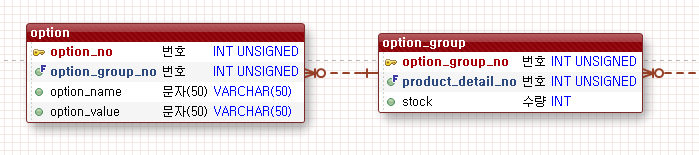
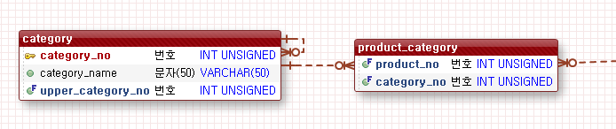
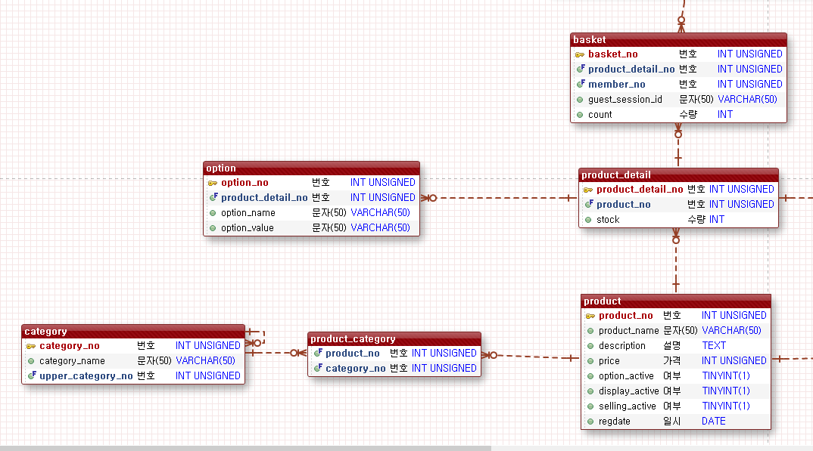

## 쇼핑몰 만들기 프로젝트
### 1주차
 - 기본 기획 WIKI 작성
 - ERD 및 유스케이스 작성
 - [참고](https://github.com/nelldkLee/shoppingmall/wiki)

### 2주차
#### Day1,2
 - 시나리오 작성
    - 회원가입 시나리오 작성
    - 
 - 기본 개발 환경 구성(Eclipse, Spring 4.3.1, 기타 필요한 라이브러리 pom.xml 구성)
--------------------------------------------
#### Day3
##### 작업할 내역
 - 로그인 시나리오 추가
    - 
 - TDD 적용
 - 기본 Controller, Service, Dao 등에서 사용할 interface 설계
 - Validation
     - Spring에서 지워하는 @Valid 어노테이션 적용
 - 장바구니 시나리오 작성
    - )
#### 이슈사항
 - RESTFul한 설계와 기본 페이지전환 방식의 설계의 차이로 인해 Controller 설계의 어려움이 있음
    - jsp가 아닌 html페이지와 Ajax호출을 통한 화면 구성

--------------------------------------------

#### Day4
- 기본 Controller, Service, Dao 등에서 사용할 interface 설계 수정
- Validation
     - Spring에서 지워하는 @Valid 어노테이션 테스트
- VO작업 및 ERD 수정
- RESTFul 설계 수립
    - 

#### Day5
- TDD 회원가입 유효성 체크
    - 

#### 이슈사항
- 유효성 체크 Exception을 받는 위치 문제로 고민
    - Cotroller 단에서 @valid가 명시된 매개변수 다음 인자로 BindResult를 통한 해결방식
    - @ControllerAdvice 어노테이션을 통해 Exception 핸들러를 통한 해결방식
    ```
    공통단에서 처리 하는 방식으로 정함. 역할과 책임을 분리하여 Controller에선 유효성 부분을 없애는 방식. 
    회원 뿐만 아니라 상품 및 주문 Controller에서도 @ControllerAdvice에 basePackages에 패키지 추가하면 간단히 끝남
    ```

### 3주차
#### Day1
- Repository 인터페이스 구성
```java
public interface GenericRepository<T, K> {

	public int insert(T vo) throws Exception;

	public T read(K key) throws Exception;

	public int update(T vo) throws Exception;

	public int delete(K key) throws Exception;

	public List<T> getList(Criteria cri) throws Exception;
}
```
- DAO TDD 작업 진행 중

- DAO TDD를 통한 erd 수정
- MariaDB 유저 생성 및 권한 부여 설정

#### Day2
- DataAccess 영역 TDD 작성(o)
- 기본 TDD 틀에 따라 일정 정리 및 계획 수립.(x)

#### 이슈사항
- DataAccess 영역 TDD 작성 시 insert, get, list, update, delete 등의 테스트를 진행하는데 앞서 deleteAll을 무조건 해야하는가라는 부분
    - dummy data에 따라 list의 옳고 그름이 결정되는 바. list는 자동화 테스트 제외.
- 'Service Layer와 Repository Layer에서 판단을 내리는 역할을 누가 할것인가?'라는 고민
    - Repository Layer는 Data를 JDBC Connectoin과 연결하고 데이터를 가져오는 역할에 집중
    - Service Layer에서 Transaction 등의 처리와 함께 판단은 Service Layer에서 하는 걸로 정함. 
- 아이디 중복검사를 통과한 상황이며 가입을 진행 중 다른 여러명이 같은 아이디로 중복검사를 통과하였을 시 제어를 하는 부분이 없다.
    - 아이디는 Unique하기 때문에 나중에 가입 하는 사람은 SqlException이 발생할 것으로 판단된다.
    - SqlException을 잡아서 해당 부분을 파악하고 customException으로 RuntimeException을 던지기로 결정. 
- Repository Layer에서 sqlSession의 메소드 호출 시 SqlException이 발생한다.
    - checked Exception으로 계속 throw 해야할지 try catch로 잡아야 할지 고민.
    - 우선 ControllerAdvice로 Exception 일괄처리 하는 객체에게 책임을 넘기기로 결정.
    - ``잘못알고 있던 부분 :`` Spring에서 checked Exception인 SqlExceptoin을 이미 try catch하여 관리하고 있었다.

#### Day3
- 회원과 상품 이외에 주문, 장바구니 등의 도메인 설계와 그에 따른 Controller 등의 인터페이스 설계
- AbstractController의 설계로 개발 속도 향상

#### 이슈사항
- Service Layer에서의 메소드와 클래스 네이밍 컨벤션을 고민.
    - 구현한 클래스는 Base*** 형태로 작성
    - 

#### Day4
- Dao와 SqlSession이 사용되던 스펙에서 Mapper 인터페이스 스펙으로 변경
- 상품 및 주문 등의 도메인과 그에 따른 Business Layer(Service)의 설계 
#### 이슈사항
- Mapper 인터페이스로 변경흐름
    - @MapperScan 어노테이션을 통해 mapper 인터페이스와 xml을 연동한다.
    - src/main/resources 소스폴더 아래에 위치한 폴더 구조를 Java package 구조와 같게하면 Java 파일이 컴파일 되며 package를 폴더화하며 같은 구조에 데이터가 묶이게 된다. 그 때 @MapperScan은 xml에 선언된 mapper의 namespace에 명시된 이름과 해당 인터페이스를 바인딩하여 빈으로 등록한다.
- ```MemberMapper.xml, MemberMapper 인터페이스, xml 내부에 namespace 이름 동일하게 하기```
- 도메인을 기반으로 Service Layer를 설계하는 부분에서 어려움을 느낌
    - 상품과 상품디테일이 각각 VO로 나뉘어 있으며 상품에 List형태로 상품 디테일이 존재
    - 이러한 경우 Service는 상품만 있으면 되려나? 상품디테일을 수정을 한다하면 상품디테일은 어떤 Service와 관계를 맺으면 될지 고민 중... 


#### Day5
- 상품 및 장바구니 프로세스 진행

#### 이슈사항
- Join해서 가져오는 데이터의 정도를 고민
    - 장바구니 같은 경우 상품 가격, 상품 이름, 옵션 데이터가 추가로 보여져야 하므로 그에 해당하는 정보를 가져오기로 결정

### 3주차
#### Day1
- 일정 테이블 수정 및 md파일로 변경

#### 추가 일정 WIKI로 이동

#### Day2
- Option 및 OptionGroup 상품(Product) 등록 시 한번에 등록 가능하게 수정
```java
{
  "description": "여름신상긴바지",
  "display": true,
  "price": 15000,
  "productDetail": {
    "optionGroupList": [
      {
        "optionList": [
          {
            "optionName": "색상",
            "optionValue": "노랑"
          },{
            "optionName": "사이즈",
            "optionValue": "95"
          }
        ],
        "stock": 10
      },{
        "optionList": [
          {
            "optionName": "색상",
            "optionValue": "빨강"
          },{
            "optionName": "사이즈",
            "optionValue": "100"
          }
        ],
        "stock": 100
      },{
        "optionList": [
          {
            "optionName": "색상",
            "optionValue": "노랑"
          },{
            "optionName": "사이즈",
            "optionValue": "90"
          }
        ],
        "stock": 23
      }
    ],
    "productDetailNo": 0
  },
  "productName": "여름긴바지",
  "selling": true
}
```
- 해당 영역 Transaction 처리. 테스트 진행 예정


#### 이슈사항
- Option 그룹과 Option의 관계와 Category 등의 다대다 관계 및 자기 참조 부분
  - 
    - option 그룹을 먼저 insert하고 해당 option_group_no를 selectKey로 가지고와야함
    - mybatis에 foreach태그를 통해 해당 option_group_no를 다중 insert 과정에서 캐치하려 하였으나 실패
    - 방안으로 DB를 두번 호출함. 아래와 같이 우선 optionGroup을 생성하고 selectKey로 가지고 온 후 해당 그룹에 해당하는 Option들을 insert 시킴
    ```java
    @Override
        @Transactional
        public void insertOptionGroupList(ProductDetailVO vo) {
            vo.getOptionGroupList().forEach((optionGroup)->mapper.insertOptionGroup(optionGroup));
            vo.getOptionGroupList().forEach((optionGroup)->mapper.insertOptionList(optionGroup));
        }
    ```
    - 상품(Product)와 카테고리(category)를 일대다가 아닌 다대다 관계라 아래와 같이 수정
  - 
- 장바구니 부분 비회원 관련 구조 및 정책을 제대로 잡지 않은 문제로 ERD 수정이 필요함
    - 내일 진행 예정

#### Day3
- ERD 구조변경
- 
```java

{
  "description": "2019 F/W 여름신상긴바지",
  "displayActive": true,
  "optionActive": true,
  "price": 15000,,
  "productDetailList": [
    {
      "optionList": [
        {
          "optionName": "색상",
          "optionValue": "노랑"
        },{
          "optionName": "사이즈",
          "optionValue": "95"
        }

      ],
      "stock": 20
    },{
      "optionList": [
        {
          "optionName": "색상",
          "optionValue": "파랑"
        },{
          "optionName": "사이즈",
          "optionValue": "100"
        }

      ],
      "stock": 100
    },{
      "optionList": [
        {
          "optionName": "색상",
          "optionValue": "노랑"
        },{
          "optionName": "사이즈",
          "optionValue": "100"
        }

      ],
      "stock": 50
    }
  ],
  "productName": "여름긴바지",
  "sellingActive": true
}
```

#### 이슈사항
- ERD의 구조를 잘못잡아 발생되는 수 많은 수정 작업...


#### Day4
- 장바구니 추가 프로세스 정리
- 장바구니 추가 시 장바구니 기존 상품 여부에 따라 update 및 insert
- 회원 및 비회원 둘다 가능


#### 이슈사항
1. 상품 리스트를 가져올 때 ADMIN과 일반 USER 사이에 필요한 컬럼의 차이 발생
    - 데이터를 동적쿼리로 구분해서 가져온다
    - Query 셋을 다르게 하여 가져온다
    - 전부 가지고 와서 필요한 부분만 화면에 셋팅 시킨다
    - 우선 전부 가지고 와서 하는 방향을 선택( 필요에 따라 대응하기 쉬워서)
2. 카테고리 단계 및 상품 등록 시 발생하는 연관 프로세스에 관련하여 고민
     - 상품 등록 시 카테고리 추가는 상품 등록 프로세스와 함께 하지 않고 비동기 방식으로
  카테고리를 추가 후 가져온 category_no를 상품 등록 form에 같이 보내기로 결정
     - 상품 등록 프로세스에선 상품과 카테고리의 다대다 관계의 중간 역할을 하는 product_category 테이블에 관계를 이어주는 insert만 한다
3. 상품 등록 프로세스에 이미지 등록 프로세스를 비동기 처리로 하는 것이 좋지 않나 고민
     - 우선 이미지는 multipart/form-data라 기존에 RestController 인터페이스의 메소드 규격에 맞지 않는다
     - 인터페이스를 바꾸지 말고 비동기로 하기로 결정
  
4. 장바구니에 상품을 추가 시 기존에 담겨 있는 상품과 같을 때 방안을 고민
   - insert할 때 select 구문으로 확인 후 있으면 Update 없으면 insert 처리
   - 단 기존의 장바구니 리스트를 가지고오는 쿼리 셋을 사용하고 검색조건과 동적쿼리를 활용해야 하나 고민
  
5. 판매가능수량의 판단 기준을 고민
   - 주문페이지로 넘어갈 때 판매가능 수량을 줄여준다
   - 세션에 판매가능수량을 담아 세션이 없어질 때의 이벤트 핸들러에 해당 세션이 메모리에서 내려갈 때 결제하지 않았다면 수량을 늘려준다.
   - 결제프로세스가 다 성공 시 Controller에서 사용자의 Session에 담겨있는 판매가능수량을 지워주어 SessionDestroyedEvent 리스너의 핸들러에서 아무런 작업이 진행되지 않게 한다.

### 3주차
#### Day1
- 회원 로그인시 장바구니 추가 프로세스 정리
- Member 클래스 역할 추가
- 리팩토링
#### 이슈사항
- 회원 로그인시 로그인 전에 담아둔 장바구니 상품 기존 회원 장바구니 데이터와 통합
```java
private void checkBasketAddedProduct(MemberVO vo) {
  List<BasketVO> basketList = basketService.getList(new Criteria().setSessionId(vo.getSessionId()));
  
  if(!basketList.isEmpty()) {
    basketList.forEach((basketVO)->{
      basketVO.setMemberNo(vo.getMemberNo());
      basketService.insert(basketVO);
    });
    basketService.deleteBasketsByMember(vo);
  }
}
```
- Member 클래스 회원인지 아닌지 판단 여부
```java
public boolean isMember() {
  return sessionId == null ? true : false;
}
```
- CustomRuntimeException 부분 반복 부분 리팩토링
```java
private void checkValidCustomException(boolean check, String message, String field) {
  if(check) {
    throw new ValidCustomException(message, field);
  }
}
```
#### Day2
- 이미지 프로세스 정리
- 관리자 용 상품 수정 프로세스 정리
- 유효성 검사 @Validated groups 명시할 field 파악
#### 이슈사항
- 이미지 업로드 경우 API 서버를 서버 단에서 접근해야할지 클라이언트가 바로 접근 가능할지 고민
  - 서버단에서 접근한다는 가정하에 이미지는 경로 등을 저장하는 API로 설계
  - 다시 말해 앞단의 서버에서 이미지는 저장하고 API서버는 경로만 저장하기로 결정
  - 상품 프로세스 수정 필요
- 트랜잭션을 생각하면서 API서버에서 처리해야 하는 일들과 세션데이터와 연관있는 프로세스 간의 명확한 분리가 어려움
  - 트랜잭션이 필요한 최소한의 영역 설정이 필요
- 메인이미지를 여러 개의 이미지와 별도로 저장해야 할지 고민
  - 상품에 필요한 메인(썸네일) 이미지를 별도의 컬럼으로 product 테이블에 추가하기로 결정
- 관리자 페이지에서 상품 수정 프로세스를 고민하게 됨
  - 상품 등록은 아래 처럼 한 프로세스에서 진행되는 것으로 하였지만 수정 부분은 분리하여 진행하는 것이 좀 더 맞다고 판단되어 각 영역 별로 비동기 호출하는 방식으로 수정을 할 예정
```java
@Transactional
public void insert(ProductVO vo) {
  mapper.insert(vo);
  List<ProductDetailVO> list = vo.getProductDetailList();
  list.forEach((productDetailVO)-> productDetailVO.setProductNo(vo.getProductNo()));
  list.forEach((productDetailVO)-> mapper.insertProductDetail(productDetailVO));
  checkOption(vo);
  checkCategory(vo);
  checkImage(vo);
}

private void checkOption(ProductVO vo) {
  if(vo.isOptionActive()) {
    optionService.insertOptionList(vo);
  }
}
	
private void checkCategory(ProductVO vo) {
  if(vo.getCategoryList().size() > 0) {
    mapper.insertProductCategory(vo);
  }
}

private void checkImage(ProductVO vo) {
  if(vo.getImageList().size() > 0) {
    imageService.insertImageList(vo);
  }
}
```
  - 영역 별로 나누어 비동기 호출을 통해 수정을 한다고 했을 때 고민해야 하는 부분이 생김
    - 유효성 검사를 VO에서 진행하였는데 기존 VO를 사용할 수가 없는 상황이 발생
    - 수정 영역을 나눌 때 마다 @Valid를 위한 VO를 만드는 방식은 아닌 것으로 판단됨
      - 어노테이션에 groups 요소를 통해 등록과 수정에 따른 유효성 필드를 구분하여 명시하면 문제가 해결되는 것으로 파악됨.
      - @Valid 어노테이션에서 @Validated로 변경 후 인자로 groups에 해당하는 class를 명시해주면 된다.
      - @Validated({ModifyStock.class}) 이런 식으로 Controller 파라미터에 명시해주고 해당 VO에 @NotBlank(groups={ModifyStock.class}) groups를 적어주면 된다. 안적으면 Default.class 타입으로 인식하므로 적절히 사용하면 될 것으로 파악
      - 작업 진행 후 해당 부분 소스코드로 적어둘 예정
      

#### Day3
- ProductDetail 클래스 Item 클래스로 변경
  
#### 이슈사항
- 상품 재고 수량 변경 API URL 네이밍 관련하여 고민
  - 기존의 RESTFul하게 만들어둔 API 네이밍과 성질이 다른 문제가 있음
  - URL에 /admin/ 을 포함시켜야하는가라는 고민
    - admin 부분은 프런트 서버에서 들어가고 API 서버에선 빼는 것으로 결정
- ProductDetail 클래스 Item 클래스로 변경
  - Product 프로세스에 있던 ProductDetail 부분 Item 프로세스로 분리
  - 변경 시 발생하는 코드 수정 완료
- 상품 등록 프로세스 마무리
- 상품 재고 수정 유효성 검사 마무리

#### Day4
- 주문 프로세스 정리

#### 이슈사항
- 주문 프로세스 정리
  - Enum 타입 설정
- 유효성 문제 발견
```java
public enum Progress {
	DEPOSIT_WAIT(1), DEPOSIT_DONE(2), DELIVERY_WAIT(3), DELIVERY_PROCEEDING(4), DELIVERY_DONE(5);

	private final int value;

	Progress(int value) {
		this.value = value;
	}
	public int getValue() {
		return value;
	}
	public static Progress valueOf(int value) {
		switch(value) {
			case 1: return Progress.DEPOSIT_WAIT;
			case 2: return Progress.DEPOSIT_DONE;
			case 3: return Progress.DELIVERY_WAIT;
			case 4: return Progress.DELIVERY_PROCEEDING;
			case 5: return Progress.DELIVERY_DONE;
			default: throw new AssertionError("Unknown Progress: " + value);
		}
	}
}
```
  - Enum 타입이 Mybatis와 문제없이 바인딩 되는지 TDD 필요
- 주문 총 금액 계산하는 것은 주문 클래스의 책임으로 판단
```java
@Data
public class OrderVO {
	private String orderNo;
	private String memberNo;
	private Enum<Progress> progress;
	private	String receiveName;
	private String zipcode;
	private String normalAddress;
	private String extendAddress;
	private int totalPrice;
	private Date regdate;
	private List<OrderItemVO> orderItemList;
	
	public int getTotalPrice() {
		orderItemList.forEach((orderItem)->{
			totalPrice += orderItem.getPrice() * orderItem.getCount();
		});
		return totalPrice;
	}
	
}

```
- VO클래스에 Collection 타입 유효성을 체크하지 못하는 것을 파악
  - Custom 클래스를 만들고 적용해야 한다는 구글링 및 블로그 내용을 발견하여 추후 적용 예정

#### Day5~6
- 주문 프로세스 정리

#### 이슈사항
- 주문 프로세스 정리
  - 주문 시 장바구니에 있는 상품 지워주는 부분 로직 정리
- 트랜잭션 고민
  - API 서버가 아닌 Front 서버에선 트랜잭션 처리가 불가
  - 장바구니 상품 지워주기 위해 OrderVO에는 결국 memberNo 혹은 sessionId가 매개변수로 전달 됨

#### 일정이 밀린 이유
- 트랜잭션 등의 프로세스의 범위를 세세하게 생각하지 못해 일정 추가
- ERD의 변화로 인해 발생되는 수 많은 수정작업 등으로 일정 추가
- TDD에 익숙하지 못해 시간 지연으로 인한 일정 추가

#### 기본 인터페이스 설명
- REST API를 분석하여 동일한 규격을 인터페이스로 설계
```java
public interface GenericRESTController<T> {

	@GetMapping
	public JSONResult list(Criteria cri);
	
	@GetMapping("/{key}")
	public JSONResult view(Long no);//@PathVariable(value="")
	
	@PostMapping
	public JSONResult register(T vo);//@RequestBody
	
	@PutMapping
	public JSONResult modify(T vo);//@RequestBody
	
	@DeleteMapping("/{key}")
	public JSONResult remove(Long no);//@PathVariable(value="")

}
```
-------
- RESTFul한 Controller는 아래와 같이 Service를 활용하기에 추상클래스로 만듦
```java
public abstract class AbstractRESTController<T, S extends GenericService> implements GenericRESTController<T>{
	
	@Autowired
	protected S service;

	@Override
	public JSONResult list(Criteria cri) {
		return JSONResult.success(service.getList(cri));
	}

	@Override
	public JSONResult view(@PathVariable(value="key") Long no) {
		return JSONResult.success(service.read(no));
	}

	@Override
	public JSONResult register(@Valid @RequestBody T vo) {
		service.insert(vo);
		return JSONResult.success(null);
	}

	@Override
	public JSONResult modify(@Valid @RequestBody T vo) {
		service.update(vo);
		return JSONResult.success(null);
	}

	@Override
	public JSONResult remove(@PathVariable(value="key") Long no) {
		service.delete(no);
		return JSONResult.success();
	}
}
```
-------
- RESTFul한 컨트롤러는 AbstractRESTController를 구현하면 원활히 동작
- 아래와 같은 형태로 VO와 Service 인터페이스를 명시해주면 끝
```java
@RestController
@RequestMapping("/api/basket")
public class BasketController extends AbstractRESTController<BasketVO, BasketService> {

}
```
```java
@RestController
@RequestMapping("/api/category")
public class CategoryController extends AbstractRESTController<CategoryVO, CategoryService>{

}
```
-------
- Exception은 ControllerAdvice로 한곳에서 처리
- @Valid로 발생되는 에러 형태와 Service에서 Throw 한 Exception의 규격을 통일하여 Front에서 한번에 처리할 수 있게 잡아둠
```java
@ControllerAdvice(basePackages = "com.cafe24.shoppingmall.controller.api")
@RestController
public class GlobalExceptionHandler {

	private static final Log LOG = LogFactory.getLog( GlobalExceptionHandler.class );
	
	@ExceptionHandler(MethodArgumentNotValidException.class)
	public Object processValidationError(MethodArgumentNotValidException ex) {
		List<Map<String, String>> list = new ArrayList<Map<String,String>>();
		ex.getBindingResult().getFieldErrors().forEach((e)-> {
			Map<String, String> map = new HashMap<String, String>();
			System.out.println(e.getField() + " : " + e.getDefaultMessage());
			map.put("field", e.getField());
			map.put("defaultMessage", e.getDefaultMessage());
			list.add(map);
		});
		return JSONResult.fail(list);
	}
	
	@ExceptionHandler(ValidCustomException.class)
	public Object customValidationError(ValidCustomException ex) {
		return JSONResult.fail(ex.getErrors());
	}
}
```
-------
- Service 또한 제네릭으로 규격을 잡아둠
- Controller와 다르게 추상클래스를 두지 않은 이유는 내부 로직이 동일하지 않기 때문
```java
public interface GenericService<T, K> {

	public void insert(T vo);

	public T read(K key);

	public void update(T vo);

	public void delete(K key);

	public List<T> getList(Criteria cri);
	
	public int getTotal(Criteria cri);

}
```
-----
- 추가되는 메소드는 인터페이스를 중간에 두어 선언함
- @Transactional 등이 프록시 패턴으로 만들어지므로 인터페이스 기반의 코드 설계
```java
public interface MemberService extends GenericService<MemberVO, Long> {
	public void verifyDuplicateId(String id);
	public MemberVO login(MemberVO vo);
}
```
-----
- Service 구현 클래스
- 기본적인 CRUD는 같은 형태로 구현됨
- Service 클래스는 상황에 따라 다른 Service 또는 Mapper를 주입 받아 프로세스를 진행
- 모든 서비스과 같은 형태로 구성되어 있음
```java
@Service
public class BaseMemberService implements MemberService{

	@Autowired
	private MemberMapper mapper;
	
	@Autowired
	private BasketService basketService;
	
	@Override
	public void insert(MemberVO vo) {
		mapper.insert(vo);
	}

	@Override
	public MemberVO read(Long key) {
		return mapper.read(key);
	}

	@Override
	public void update(MemberVO vo) {
		mapper.update(vo);
	}

	@Override
	public void delete(Long key) {
		mapper.delete(key);
	}

	@Override
	public List<MemberVO> getList(Criteria cri) {
		return mapper.getList(cri);
	}

	@Override
	public int getTotal(Criteria cri) {
		return mapper.getTotal(cri);
	}

	@Override
	public void verifyDuplicateId(String id) {
		isValidCustomException(mapper.findById(id).isPresent(), ValidationMessage.ID_DUPLICATED, ValidationMessage.ID_FIELD);
	}

	/*
	 * 	parameter : MemberVO(sessionId, id, password)
	 *  sessionId를 가져오는 이유 : 장바구니 상품 추가 해주기 위해
	 */
	@Override
	public MemberVO login(MemberVO vo) {
		Optional<MemberVO> optionalMemberVO = mapper.findByIdAndPassword(vo);
		
		isValidCustomException(!optionalMemberVO.isPresent(), ValidationMessage.ID_PW_WRONG, ValidationMessage.ID_PW_FIELD);
		// DB에서 회원 데이터를 가져옴
		MemberVO memberVO = optionalMemberVO.get();
		memberVO.setSessionId(vo.getSessionId());
		isBasketExistedProduct(memberVO);
		
		return memberVO;
	}

	private void isValidCustomException(boolean check, String message, String field) {
		if(check) {
			throw new ValidCustomException(message, field);
		}
	}

	private void isBasketExistedProduct(MemberVO vo) {
		List<BasketVO> basketList = basketService.getList(new Criteria().setSessionId(vo.getSessionId()));
		
		if(!basketList.isEmpty()) {
			basketList.forEach((basketVO)->{
				basketVO.setMemberNo(vo.getMemberNo());
				basketService.insert(basketVO);
			});
			basketService.deleteBasketsByMember(vo);
		}
	}
	
}

```
-----
- Repository 영역 또한 위와 같은 흐름으로 구성됨
- 관련 흐름은 Dao에서 Mapper로 변경하는 부분(3주차 Day4)참고바람
-----
- 마지막으로 VO는 Lombok을 활용하여 Getter,Setter 등의 반복 작업을 줄임
- @NotBlank 등 유효성 검사 추가함

```java
@Data
@NoArgsConstructor
public class MemberVO {
	
	public MemberVO(String id, String memberName, String password, String email, String telephone, String gender, String zipcode,
			String normalAddress, String extendAddress) {
		this.id = id;
		this.memberName = memberName;
		this.password = password;
		this.email = email;
		this.telephone = telephone;
		this.gender = gender;
		this.zipcode = zipcode;
		this.normalAddress = normalAddress;
		this.extendAddress = extendAddress;
	}
	private Long memberNo;
	@NotBlank(message = ValidationMessage.ID_BLANK)
	private String id;
	@NotBlank(message = ValidationMessage.MEMBER_NAME_BLANK)
	private String memberName;
	@Pattern(regexp = ValidationMessage.PASSWORD_REGEX, message = ValidationMessage.PASSWORD_PATTERN)
	private String password;
	@NotBlank(message = ValidationMessage.EMAIL_BLANK)
        @Email(message = ValidationMessage.EAMAIL_PATTERN)
	private String email;
        @Pattern(regexp = ValidationMessage.TELEPHONE_REGEX, message = ValidationMessage.TELEPHONE_PATTERN)
        private String telephone;
        private String sessionId;
        private String gender;
	private Date regDate;
	private String zipcode;
	private String normalAddress;
	private String extendAddress;
	private List<BasketVO> basketList;
	
	public boolean isMember() {
		return sessionId == null ? true : false;
	}
}
```

### 4주차

#### Day1
- 스프링 부트로 변경 시도

#### 이슈사항
- OAuth 2.0을 적용시키고자 스프링 부트 기반으로 옮기려 했으나 lib 충돌 등으로 롤백하게됨
  - Spring 기반으로 적용을 시킬지 말지 고민
  - 화면 단 일정 밀려있는 관계로 추후 적용 예정

#### Day2
- 백엔드 API서버 및 프런트 서버 구조 변경 및 작업

#### 이슈사항
- 구조 변경으로 Pom.xml 등을 parent와 child로 중복 사용되는 lib를 상위 pom으로 옮김
  - 해당 프로젝트에 필요한 lib와 아닌 lib를 구분하는데 어렴움이 있었음
  - 공통적으로 필요하다 여겨지는 lib는 상위로 올림
- API 서버에서 받아오는 데이터는 JSON 데이터로 넘어오는걸 프런트 서버에서 받을 때 어떻게 받을지 고민
  - API 서버에 명시해뒀던 VO들을 전부 가져오는건 불필요할 것으로 판단되어 HashMap으로 받고 JSP에서 태그라이브러리를 활용하여 구성
  - 로그인과 회원 가입 상품 등록 등의 상황에선 Ajax로 호출할 예정
    - 유효성 검사가 필요한 부분은 화면의 전환없이 처리하기 위해
  
#### Day3
- SpringSecurity 적용 및 Oauth2로 구조 변경 시도

#### 이슈사항
  - 인터셉터로 프런트 서버에서 인증 인가를 처리하려하였던 부분을 SpringSecurity와 Oauth2.0 스펙으로 변경의 어려움을 겪음
  


